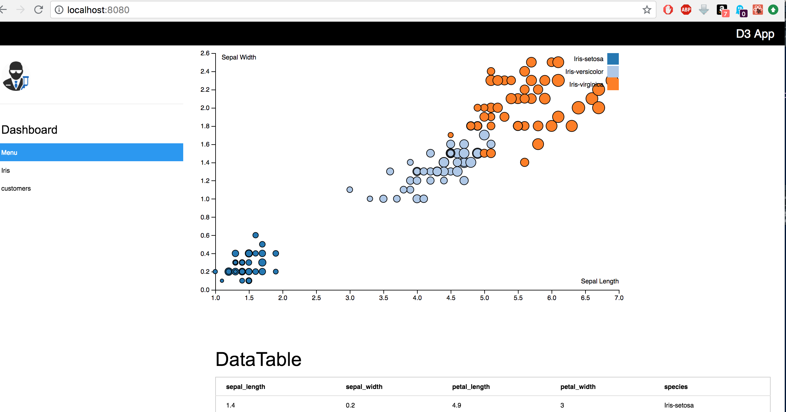

App to construct a basic graph for typical 
data science data sets and display associated data table

To have babel transpile our JSX code first set up our 
package.json and .babelrc files 

Call:
npm install

To have babel watch changes to a file: 
./node_modules/.bin/babel ./jsx/filterMenu.jsx --watch --out-file ./public/js/filterMenu.js